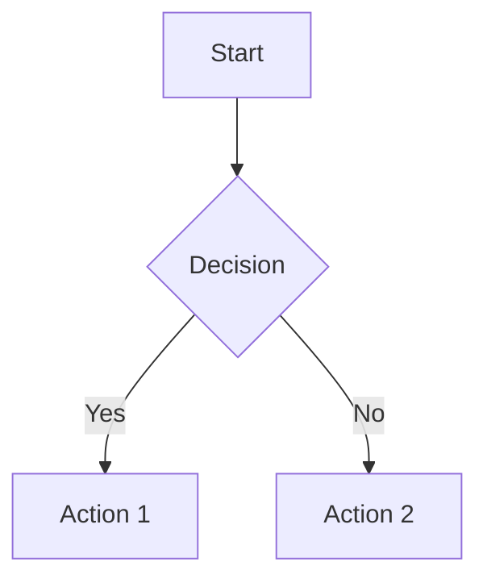

# Markdown Syntax Guide

Hướng dẫn đầy đủ về cú pháp Markdown cho Hugo content.

## Headings (Tiêu đề)

```markdown
# Heading 1 (Lớn nhất)
## Heading 2
### Heading 3
#### Heading 4
##### Heading 5
###### Heading 6 (Nhỏ nhất)
```

## Text Formatting (Định dạng văn bản)

```markdown
**Bold text** hoặc __Bold text__
*Italic text* hoặc _Italic text_
***Bold and italic*** hoặc ___Bold and italic___
~~Strikethrough~~
`Inline code`
```

## Links (Liên kết)

```markdown
[Link text](https://example.com)
[Link với title](https://example.com "Title text")
<https://example.com> (Auto-link)
[Reference link][ref]
[ref]: https://example.com
```

## Images (Hình ảnh)

```markdown


![Reference image][img-ref]
[img-ref]: image.jpg "Title"
```

## Lists (Danh sách)

### Unordered List (Danh sách không đánh số)

```markdown
- Item 1
- Item 2
  - Nested item 2.1
  - Nested item 2.2
- Item 3

* Hoặc dùng dấu *
+ Hoặc dùng dấu +
```

### Ordered List (Danh sách đánh số)

```markdown
1. First item
2. Second item
3. Third item
   1. Nested item 3.1
   2. Nested item 3.2
```

### Task List (Danh sách công việc)

```markdown
- [x] Completed task
- [ ] Incomplete task
- [x] Another completed task
```

## Code Blocks (Khối code)

### Inline Code

```markdown
Use `console.log()` to print to console.
```

### Code Block với Language

````markdown
```python
def hello():
    print("Hello, World!")
```
````

### Code Block không có Language

````markdown
```
Plain code block
```
````

### Supported Languages

- `python`, `javascript`, `java`, `c`, `cpp`, `csharp`
- `html`, `css`, `sql`, `json`, `yaml`, `xml`
- `bash`, `shell`, `powershell`
- `go`, `rust`, `ruby`, `php`, `swift`
- Và nhiều ngôn ngữ khác...

## Blockquotes (Trích dẫn)

```markdown
> This is a blockquote.
> It can span multiple lines.
> 
> > Nested blockquote
```

## Horizontal Rules (Đường kẻ ngang)

```markdown
---
***
___
```

## Tables (Bảng)

```markdown
| Header 1 | Header 2 | Header 3 |
|----------|----------|----------|
| Cell 1   | Cell 2   | Cell 3   |
| Cell 4   | Cell 5   | Cell 6   |

| Left align | Center align | Right align |
|:----------|:------------:|------------:|
| Left      | Center       | Right       |
```

## Escaping Characters (Ký tự đặc biệt)

```markdown
\* Not italic \*
\# Not heading
\[Not a link\]
```

## HTML (Có thể dùng HTML trong Markdown)

```markdown
<div class="custom-class">
  <p>HTML content</p>
</div>

<button onclick="alert('Hello')">Click me</button>
```

## Line Breaks (Xuống dòng)

```markdown
Line 1
Line 2 (cần 2 spaces ở cuối dòng 1)

Line 3 (cách một dòng trống)
```

## Emphasis Combinations (Kết hợp nhấn mạnh)

```markdown
**Bold** and *italic* text
***Bold and italic***
`Code` in **bold** text
```

## Links trong Text

```markdown
Check out [GitHub](https://github.com) for code hosting.
Visit [UET](https://uet.vnu.edu.vn) website.
```

## Images với Links

```markdown
[](https://example.com)
```

## Definition Lists (Hugo hỗ trợ)

```markdown
Term 1
: Definition 1

Term 2
: Definition 2a
: Definition 2b
```

## Footnotes (Chú thích cuối trang)

```markdown
Here's a sentence with a footnote[^1].

[^1]: This is the footnote.
```

## Abbreviations (Viết tắt)

```markdown
*[HTML]: HyperText Markup Language
*[CSS]: Cascading Style Sheets

HTML và CSS là các công nghệ web.
```

## Math (Toán học - nếu Hugo hỗ trợ)

```markdown
Inline math: $E = mc^2$

Block math:
$$
\int_{-\infty}^{\infty} e^{-x^2} dx = \sqrt{\pi}
$$
```

## Mermaid Diagrams (Biểu đồ - Hugo hỗ trợ)

````markdown

````

## Front Matter (YAML cho Hugo)

```yaml
---
title: "Page Title"
description: "Page description"
date: 2024-01-01
tags: ["tag1", "tag2"]
draft: false
---
```

## Hugo Shortcodes (Shortcode đặc biệt)

### YouTube (nếu đã tạo)

```markdown

```

### Figure

```markdown

```

### Highlight

```markdown

def hello():
    print("Hello")

```

## Ví dụ hoàn chỉnh

```markdown
---
title: "Markdown Example"
date: 2024-01-01
---

# Main Heading

This is a paragraph with **bold** and *italic* text.

## Code Example

```python
def greet(name):
    return f"Hello, {name}!"
```

## List Example

1. First item
2. Second item
   - Nested item
   - Another nested item

## Table Example

| Name | Age | City |
|------|-----|------|
| John | 25  | NYC  |
| Jane | 30  | LA   |

## Link Example

Visit [GitHub](https://github.com) for more info.

> This is a blockquote with important information.
```

## Tips

1. **Spacing**: Cần một dòng trống giữa các block elements
2. **Indentation**: Dùng 2 hoặc 4 spaces cho nested items
3. **Code blocks**: Dùng 3 backticks (```) cho code blocks
4. **Tables**: Cần header row và separator row
5. **Images**: Luôn thêm alt text cho accessibility
6. **Links**: Có thể dùng reference-style links để dễ quản lý

## Hugo-specific Features

- **Shortcodes**: `` hoặc `{}`
- **Variables**: `{{ .Title }}`, `{{ .Params.custom }}`
- **Conditionals**: `{{ if .Params.featured }}...{{ end }}`
- **Ranges**: `{{ range .Pages }}...{{ end }}`


